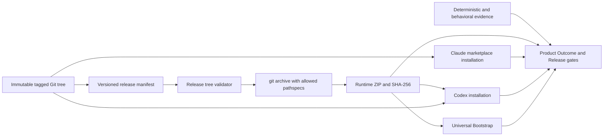

# Architecture

## Scope And Inputs

Эта архитектура покрывает Target Milestone `v0.5 - Distribution And Delivery Assurance` и все пять Development Epics из `docs/development-roadmap.md`. Первый implementation focus ограничен `Epic 1 - Release Artifact Boundary`.

Входы:

- `docs/discovery-summary.md`;
- `docs/project-brief.md`;
- `docs/development-roadmap.md`;
- `.studio/standards-profile.md`;
- `.studio/design-system-profile.md`;
- `docs/BEHAVIORAL_ASSURANCE.md`;
- `docs/RELEASING.md`;
- существующие release builder, Runtime harness, adapter manifests и structure tests.

Принятые product boundaries сохраняются. Architecture не добавляет новые Runtime, hosted service, database, authentication system или UI surface.

### Requirement Trace

| Product capability | Acceptance criteria | Technical responsibility | Decision | Expected evidence |
| --- | --- | --- | --- | --- |
| Чистый installable Runtime | ZIP не содержит self-hosting и dev-only artifacts | Manifest-driven release packager | ADR-0001 | Archive entry assertions и checksum |
| Critical lifecycle assurance | Десять сценариев покрывают принятые риски | Versioned critical-suite contract и существующий harness | Preserve and extend | Deterministic, fixture и replay results |
| Adapter parity | Codex, Claude Code и Universal дают одинаковые stage outcomes | Host adapter smoke boundary | Preserve canonical Runtime | Installed Adapter Matrix |
| Remote/local compatibility | Три независимых trial с точными identities | Existing executor/judge boundary и immutable evidence | Preserve policy | Compatibility summary |
| Milestone release candidate | Все evidence streams оцениваются вместе | Existing Validation, QA, Product Outcome и Release gates | Preserve lifecycle separation | Product Outcome и release evidence |

## Studio Delivery And Support Model

Studio OS отвечает за архитектуру, реализацию, validation, QA, release preparation, operational readiness и дальнейшую поддержку через Work Item workflows. Пользователь остается владельцем продуктовых решений и отдельного разрешения на публикацию.

Внешний implementation или operations handoff не принят. Техническая сложность не переносится на пользователя и не снижает quality gates.

## System Context

Studio OS состоит из installable Runtime, development-time assurance tooling и distribution surfaces. Source checkout является системой разработки; tagged ZIP является отдельным пользовательским artifact.

### Boundaries

- Runtime boundary: `skill/`, `skills/studio-os/`, `adapters/universal/`, `templates/` и host manifests.
- Public documentation boundary: только явно утвержденные документы и root metadata.
- Maintainer boundary: `.studio/` и lifecycle artifacts, созданные self-hosting workflow.
- Development boundary: scripts, tests, test results, package tooling и GitHub workflows.
- Website boundary: `website/` публикуется через GitHub Pages и не требуется installable Runtime.

## Technology Selection And Alternatives

### Recommendation

Сохранить существующий стек:

- Markdown и JSON для Runtime, registries, policies и manifests;
- TypeScript ESM и Node.js для release и test tooling;
- Git как immutable source tree и archive provider;
- GitHub Actions, Releases и Pages для distribution;
- static HTML, CSS и JavaScript для существующего сайта.

Добавить versioned JSON release manifest как единственный package-content source of truth. Новая production или runtime dependency не требуется.

### Alternative 1: расширять `.gitattributes export-ignore`

Product fit: минимальное изменение текущего подхода.

Trade-off: denylist пропускает каждый новый файл по умолчанию. Self-hosting artifact снова попадет в ZIP, пока maintainer явно не добавит исключение.

Decision: отклонено как основная package boundary. `.gitattributes` остается defense in depth.

### Alternative 2: manifest-driven `git archive` с allowlisted pathspecs

Product fit: новый файл не попадает в package без явной классификации, при этом immutable tag и текущий archive format сохраняются.

Trade-off: новые public docs и новые Runtime roots требуют осознанного manifest update и review.

Decision: принято.

### Alternative 3: отдельный Runtime repository или package subtree

Product fit: дает сильную физическую изоляцию.

Trade-off: меняет root resolution, adapter layout, release process и contributor workflow; миграционный риск несоразмерен `v0.5`.

Decision: отклонено для текущего milestone. Пересмотр возможен только при росте независимых distribution targets.

## Architecture Overview

Архитектурный стиль остается repository-centered modular toolchain без hosted control plane.

1. **Runtime Core** хранит канонические workflow contracts и не зависит от release tooling.
2. **Release Contract Plane** определяет допустимый состав package и строит archive из immutable tag.
3. **Assurance Plane** разделяет deterministic, fixture/replay, installed-adapter и model behavioral evidence.
4. **Distribution Plane** публикует один согласованный release через три заявленных adapter paths.
5. **Public Site** остается независимой GitHub Pages surface и не включается в installable Runtime.

## Components And Responsibilities

### Runtime Release Manifest

Планируемый source: `scripts/release-manifest.json`.

Responsibilities:

- schema version;
- allowlisted directory roots;
- allowlisted individual files;
- required Runtime entry points;
- forbidden maintainer и development prefixes;
- явная классификация public documentation.

Manifest хранится в Git и читается из revision, соответствующей release tag. Он является development contract и сам не обязан входить в installable ZIP.

### Release Manifest Loader And Validator

Responsibilities:

- parse structured JSON без ad hoc string manipulation;
- reject unknown schema versions, duplicate paths, ambiguous overlaps и unsafe path traversal;
- verify required entry points;
- verify that every allowlisted path exists in tagged tree;
- fail when resolved content intersects forbidden prefixes.

### Release Tree Resolver

Использует `git ls-tree` против принятого tag и manifest pathspecs. Результатом является точный ordered set tracked files, который будет передан archive builder.

Он не читает untracked working-tree files и не следует machine-local filesystem paths.

### Archive Builder

Сохраняет существующие guarantees:

- clean checkout;
- `HEAD` соответствует release tag;
- `git archive --format=zip`;
- versioned root prefix;
- SHA-256 checksum;
- fail-closed command handling.

Изменение: archive получает только manifest pathspecs, а не весь tag.

### Release Contract Tests

Structure tests строят реальный tagged fixture archive и проверяют:

- обязательные entries;
- отсутствие forbidden categories;
- checksum;
- clean/tag gates;
- failure при missing required entry;
- failure при появлении self-hosting Project Memory или lifecycle artifact.

### Critical Suite Contract

Планируемый source: `tests/runtime/critical-suite.json`.

Хранит versioned список десяти scenario IDs из принятого roadmap. Runner разрешает выбор suite как одного bounded evaluation unit и проверяет существование каждого scenario.

### Runtime Assurance Harness

Существующие `scripts/run-runtime-tests.ts` и `scripts/runtime-testing/` сохраняют обязанности executor, judge, fixture workspace и replay checkpoints. Critical-suite contract не раскрывает expectation bodies executor-модели.

### Installed Adapter Evidence

Codex, Claude Code и Universal выполняются как отдельные host environments. Raw evidence остается local/ignored; переносимая summary фиксирует Studio OS revision, adapter, host version, scenario, outcome и failure class.

### Compatibility Evidence

Raw trial records остаются immutable внутри ignored `test-results/`. Public или checked-in summaries содержат только sanitized identities, classifications и bounded failure descriptions. Полные приватные transcripts не публикуются.

## Data Ownership And Model

### Release Manifest

- `version`: schema revision;
- `includeTrees`: approved recursive Runtime roots;
- `includeFiles`: approved individual metadata и public docs;
- `requiredFiles`: exact activation и distribution entry points;
- `forbiddenPrefixes`: maintainer, development и generated categories.

### Resolved Release Tree

- source tag;
- ordered set of tracked relative file paths;
- manifest version;
- validation outcome.

Список вычисляется заново из immutable tag и не хранится как второй ручной source of truth.

### Behavioral Trial Identity

Сохраняется существующая модель из `docs/BEHAVIORAL_ASSURANCE.md`: Studio OS revision, scenario revision, engine, adapter, exact executor/judge identities, provider или host version, timeout, trial number и timestamp.

### Installed Adapter Record

- Studio OS release и revision;
- adapter и host version;
- distribution source;
- scenario identity;
- observable outcome;
- failure ownership;
- sanitized references.

## Interfaces And Integrations

- Git CLI: `ls-tree`, tag/HEAD checks и `archive` над одной revision.
- Node.js: JSON parsing, process execution, hashing, filesystem output и test runner.
- GitHub Actions: deterministic gates, release build и authorized publication.
- GitHub Releases: ZIP и checksum distribution.
- Codex и Claude Code marketplaces: immutable tag references.
- Universal consumer: extracted ZIP и `adapters/universal/BOOTSTRAP.md`.
- Model engines: существующие Codex CLI и direct Ollama boundaries; будущие provider adapters только через отдельное принятое решение.

Интерфейсы не используют абсолютные project paths в persistent artifacts.

## Authentication And Authorization

- Local package build не требует внешней аутентификации.
- Marketplace smoke tests используют аутентификацию соответствующего host вне Runtime artifacts.
- GitHub publication получает short-lived workflow token только на release job.
- Tag, push, release creation и deployment остаются explicit authorization actions.
- Architecture не добавляет пользовательскую account system или hosted secret storage.

## Security And Privacy

- Manifest paths должны быть normalized project-relative и не могут содержать traversal, absolute или home references.
- Archive строится только из tracked tagged tree; untracked `.studio/` не рассматривается, а tracked maintainer artifacts блокируются manifest boundary.
- Raw trials и host evidence не включают реальные project fixtures без explicit authorization.
- Checked-in summaries исключают machine paths, secrets, private prompts и полные transcripts.
- Remote model execution остается cost- и privacy-gated.
- Release builder fail-closed при malformed manifest, missing path, Git failure или contract mismatch.

## Reliability And Failure Handling

- Release manifest validation выполняется до создания archive.
- Required entry point failure блокирует package.
- Forbidden resolved path failure блокирует package.
- Dirty checkout или tag mismatch блокирует package.
- Archive command или checksum failure блокирует package.
- Adapter failure не компенсируется успехом другого adapter.
- Behavioral failure не получает автоматический retry.
- Invalid trial сохраняется отдельно и не увеличивает compatibility pass count.
- Product Outcome агрегирует все Epics; отдельный PASS не меняет milestone readiness.

## Observability

- Deterministic commands возвращают exit code и bounded diagnostics.
- Release build записывает archive name и checksum; manifest version и source tag должны попадать в validation evidence.
- Runtime trials сохраняют machine-readable JSON и Markdown summary.
- Installed adapter summary использует единый outcome и failure-ownership vocabulary.
- CI сохраняет logs и release artifacts в соответствующем GitHub run; Project Memory хранит только переносимые ссылки и решения.

## Deployment And Environments

### Development

- Git checkout с npm dev dependencies, scripts, tests, website и self-hosting Project Memory.
- Generated `dist/` и `test-results/` остаются ignored.

### Candidate

- Clean checkout на принятой revision.
- Manifest validation и deterministic gates.
- Локально созданные ZIP и checksum без publication side effect.

### Release

- Annotated tag соответствует version contract.
- GitHub Actions повторяет deterministic gates и строит archive из tag.
- GitHub Release создается только после explicit authorization через tag push.

### Public Site

- `website/` продолжает независимо публиковаться через GitHub Pages из `main`.
- Site artifact не включается в Runtime ZIP.

## Migration And Compatibility

- Existing published tags и archives остаются неизменными.
- Manifest-driven packaging применяется только к следующему принятому release revision.
- Runtime root layout, plugin manifests и Universal Bootstrap paths не меняются.
- `.gitattributes export-ignore` сохраняется как secondary protection и source-export convention.
- Existing release tests мигрируют от проверки нескольких denylist rules к проверке фактического allowlisted archive.
- Self-hosting Project Memory остается tracked в source checkout, но исключается из Runtime package.
- Brownfield roadmap хранится в `docs/development-roadmap.md`, поскольку default `docs/roadmap.md` конфликтует с существующим `docs/ROADMAP.md` на case-insensitive filesystem. Общий Runtime collision guard рассматривается как compatibility risk и не должен приводить к перезаписи существующего artifact.

Rollback для Epic 1: до publication можно вернуть предыдущий packager и manifest commit. После publication tag остается immutable; исправление требует нового patch/prerelease tag.

## Design System Compatibility

Epic 1 и принятая architecture не изменяют `website/`, HTML/CSS/JavaScript stack, tokens, assets или interaction patterns. `.studio/design-system-profile.md` сохраняет `Preserve And Extend`.

Interface Design не требуется. Любое будущее изменение public site остается отдельным interface scope и должно повторно оценить Design System Profile.

## Testing Strategy

### Deterministic

- unit tests manifest schema и path normalization;
- release fixture tests с real Git tag;
- exact required/forbidden archive entry assertions;
- checksum и clean/tag checks;
- structure tests adapter roots, registries, public site и portability;
- `npm run test:runner`;
- `npm run test:runtime:dry`;
- `npm run release:check` для release-impacting изменений.

### Behavioral

- versioned critical suite;
- fixture/replay checkpoints для file-changing и cross-turn behavior;
- separate executor и judge;
- three valid trials per accepted baseline combination;
- no automatic retries.

### Installed Adapters

- fresh Greenfield и Brownfield workspaces;
- exact installed package root;
- Codex, Claude Code и extracted Universal ZIP;
- observable stage outcome и source-integrity evidence.

### Release

- plugin и skill validators;
- candidate archive inspection;
- checksum verification;
- installation outside repository checkout;
- explicit Product Outcome и Release authorization gates.

## Applied Standards And Quality Gates

Accepted core standards:

- `code-quality`;
- `testing`;
- `security-privacy`.

Accepted domain standards remain:

- `web-frontend`;
- `accessibility`;
- `product-design`.

Project-specific contracts:

- `docs/QUALITY_GATES.md`;
- `docs/BEHAVIORAL_ASSURANCE.md`;
- `docs/runtime-testing.md`;
- `docs/RELEASING.md`;
- `.studio/standards-profile.md`;
- `.studio/design-system-profile.md`.

No quality deviation is approved for speed. A missing host, model or validator produces Blocked or Unknown evidence rather than a lowered gate.

## Architecture Decisions And ADRs

- `docs/adr/0001-manifest-driven-runtime-package.md`: explicit allowlisted Runtime package manifest replaces denylist-only release composition.
- Existing behavioral assurance, zero-retry, Project-Local Reference и Product Outcome decisions are preserved.

## Risks And Unknowns

- Exact public documentation allowlist needs review during Development; adding every `docs/` file would reintroduce self-hosting leakage.
- General case-insensitive artifact collision handling is not yet a canonical Runtime contract.
- Git pathspec behavior must be verified on the CI Git version used by release workflow.
- Exact remote/local model identities remain an Epic 4 decision based on then-current reproducible evidence.
- Claude Code and Codex host versions may change activation behavior independently of this architecture.
- A manually maintained manifest can omit a new required Runtime file; required entry checks and installed smoke tests are compensating controls.
- Full baseline requires an estimated 132 model calls under the accepted scenario/turn count; cost is unknown until models are selected.

## Interface Design Handoff

Interface Design is skipped for the current increment because release composition has no user-interface or design-system impact.

Re-enter Interface Design only if Development proposes a user-facing change to `website/`, install interactions or another product interface. Such a proposal would require scope validation first.

## Development Handoff

Current increment: `Epic 1 - Release Artifact Boundary`.

Development must:

- implement ADR-0001 without changing Runtime root layout;
- add the versioned release manifest and fail-closed validation;
- build from exact allowlisted tag paths;
- preserve checksum, clean checkout, tag matching and required entry guarantees;
- make actual archive contents the regression evidence;
- exclude `.studio/`, self-hosting lifecycle artifacts, website and dev-only content;
- update release documentation only where the accepted package contract changes;
- leave adapter behavior, Runtime contracts and public site design unchanged;
- create `.studio/telemetry/development-report.md` with exact validation evidence.

Development must not publish a tag or release. After implementation it hands the increment to Validation.
